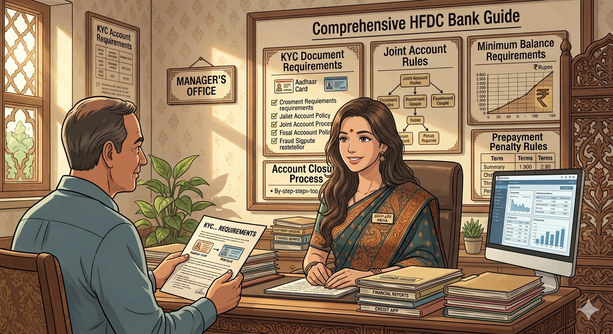
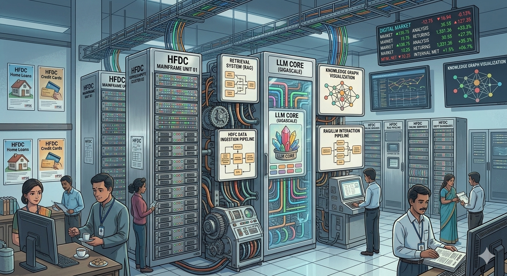

# HFDC Bank – Capstone Support Agent (LangGraph)

## 📌 Project Overview
This capstone project builds a **production‑minded domain support agent** for **HFDC Bank**.  
The agent is designed to answer loan policy questions, check loan application statuses, and provide consistent, resilient support to staff and customers.

The system integrates:
- Dataset design & validation
- Knowledge base construction
- Retrieval‑Augmented Generation (RAG)
- LangGraph orchestration
- Agent memory & guardrails
- Evaluation & observability
- FastAPI deployment
- Resilience features (MCP, checkpointing, retries, timeouts)

---

## 🎯 Objectives
- Provide **instant, consistent answers** to HFDC loan policy queries.
- Allow staff to **check loan application status** quickly and reliably.
- Ensure the agent is **safe, resilient, and production‑ready**.
- Deploy behind a **FastAPI backend** with structured logging and evaluation.

---

## 🏦 HFDC Loan Categories
The dataset covers multiple loan types:
- Personal Loan  
- Home Loan  
- Auto Loan  
- Education Loan  
- Business Loan  

Each loan application record includes:
- `record_id`
- `category`
- `status` (Submitted, Under Review, Approved, Rejected, Disbursed)
- `loan_amount_inr`
- `days_since_created`
- `flagged_for_fraud_review`

Fraud review percentage is calibrated between **10–30%**.

---

## 📚 Knowledge Base Topics
At least **12 documents** (2–5 sentences each) cover:
- Loan eligibility criteria by type
- EMI calculation rules
- Credit card fee structure
- KYC document requirements
- Fraud dispute resolution
- Account closure process
- Interest rate slabs
- Prepayment penalty rules
- Minimum balance requirements
- Credit score impact factors
- Joint account rules
- NRI account eligibility

---

## 🧩 System Architecture
### Part 1 – Dataset & RAG Core
- Deterministic dataset generator (`dataset.py`)
- Knowledge base documents
- Two chunking strategies (fixed‑size overlap + sentence‑based)
- Embedding with SentenceTransformers
- Retrieval via ChromaDB
- Grounded generation with calibrated similarity threshold
- Precision@3 and Recall@3 evaluation

### Part 2 – LangGraph Agent
- Tool: `check_loan_application_status(record_id)`
- Escalation score formula combining fraud flag + recency
- LangGraph graph with ≥4 nodes and conditional routing
- Persisted memory (JSON file)
- Structured output schema (JSON Schema validation)
- Guardrails: PII masking (PAN/Aadhaar, bank account), injection detection, groundedness fallback

### Part 3 – Deployment & Evaluation
- FastAPI backend with ≥2 endpoints
- Structured JSON‑Lines logging (masked PII)
- Evaluation harness with **golden set** of 15 queries
- RAG triad scoring (context relevance, groundedness, answer relevance)

### Part 4 – Resilience & Interoperability
- MCP exposure via `fastmcp`
- SQLite checkpointing with `langgraph-checkpoint-sqlite`
- Timeouts & retries (per‑node + global)

---

## 🧪 Evaluation
- **Golden set**: 15 queries (covering all KB topics + 2 out‑of‑scope)
- **Judge**: LLM‑as‑judge prompt (MOCK_LLM mode)
- **Metrics**: Context relevance, groundedness, answer relevance
- **Output**: Per‑query scores + averages

---

## ✅ Acceptance Criteria
- Dataset ≥40 records, meeting thresholds
- KB ≥12 documents, all topics covered
- Retrieval works under MOCK_LLM
- Guardrails demonstrably fire
- FastAPI endpoints functional
- Structured logs with masked PII
- MCP client‑server round trip successful
- Checkpointing resumes correctly
- Retry/timeout policies demonstrated

---

## 📂 Deliverables
- Public GitHub repository containing:
  - `dataset.py`
  - Knowledge base documents
  - RAG core
  - LangGraph agent
  - Resilience/MCP layer
  - FastAPI deployment
  - Evaluation scripts
  - README.md (documenting dataset design, thresholds, evaluation numbers)

---

## 📝 Notes

- All examples are **fabricated**; no real customer data is used.
- MOCK_LLM mode ensures reproducibility without API keys.
- Groq or other LLM APIs may be optionally wired in, but grading requires MOCK_LLM compliance.
